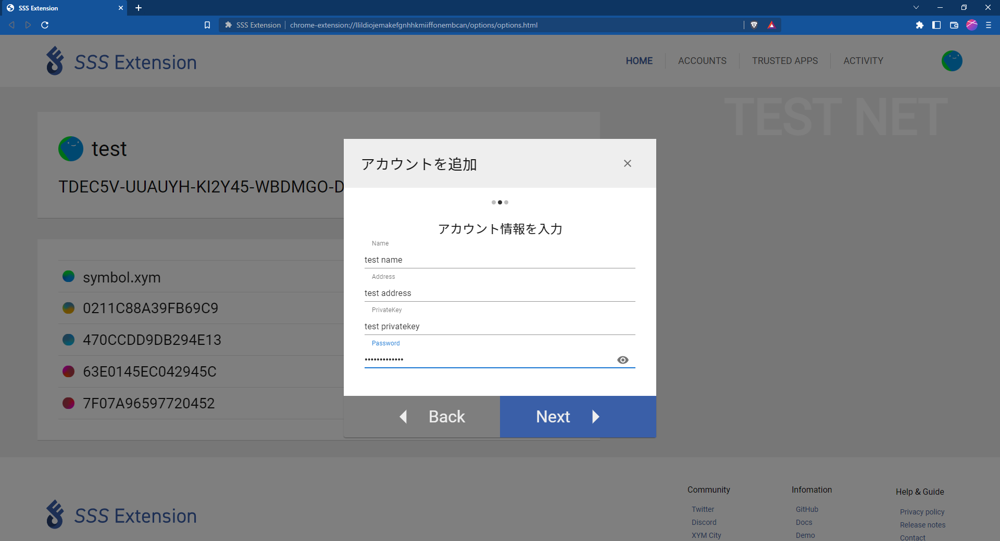

# Account Setting

This section describes the features of the SSS Extension account.

## Import account

:::danger

- SSS Extension does not store private keys and passwords, so be careful not to lose sensitive information yourself.
- SSS Extension stores an encrypted private key, an encrypted password set by the user.
- If you forget your password and you are unable to log into your SSS Extension account, you will need to unregister and re-register your account so that you can reset your password.

:::
SSS Extension supports the following three account registration methods.

Click the icon in the upper right corner of the screen and select "Add Account" to add your account.

- Import private key
- Create a new account
- Hardware Wallet

### 1. Import private key

When you select Import Private Key, the following screen will appear.

- Name : Enter any name for your account.
- Address : Enter the address of the Symbol account you want to add.
- PrivateKey : Enter the private key of the added account.
- Password : Enter the password that will be used to authenticate your account.

Please fill in the input fields and click the "Next" button in the lower right corner.

Check the entered information and click the "Finish" button to complete the account registration.

If you want to correct the entered information, click the "Back" button.

### 2. Registration

After selecting "Create Account", the following screen will appear.

- Name : Enter any name for your account.
- Password : Enter the password that will be used to authenticate your account.

Please fill in the input fields and click the "Next" button in the lower right corner.

After proceeding to the confirmation screen, please check the entered information and click the "Done" button to complete the account registration.

If you want to correct the entered information, click the "Back" button.

### 3. Hardware Wallet

Select "Hardware Wallet" and the following screen will appear.

SSS Extension supports Ledger hardware wallets. So you can connect the Ledger to your PC and then open the Symbol desktop wallet and you will see the connected hardware wallet on the screen and you can easily link it to the SSS Extension.

Select the network and address to add, enter a name, and click Next.

After proceeding to the confirmation screen, please check the entered information and click the "Done" button to complete the account registration.

If you want to correct the entered information, click the "Back" button.

## Private key confirmation

Click the eye icon to the right of the active account's private key to display the password entry screen.

You can check the private key by entering the password and clicking the "CHECK" button.

## Change active account

Click the gear icon in the top right corner to open the menu.

By clicking "Change to Active Account", you can change the account to an active account.

## Cancellation of account registration

Open the account menu and click "Unregister account", the account information will be deleted from the SSS extension.
