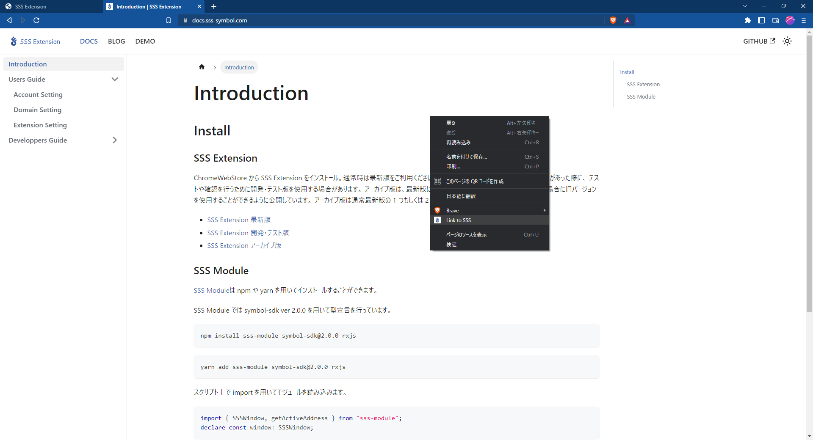

# Domain Setting

This section will explain how to link SSS_Extension and a decentralized application (dApps).

## dApp integration

Right click on the dApps page to open the menu. Select Link to SSS from this menu. Reload the page and everything will work with SSS_Extension.

## dApps Connections

Open the "TRUSTED APS" tab, enter the URL of the dApp you want to link into the text box, and click the "+" button to add it to the SSS_Extension list.

## dApps Disabling 

If you want to unlink a decentralized application (dApps) from SSS_Extension, you can easily do so by clicking the "☓" icon displayed to the right of the URL.

