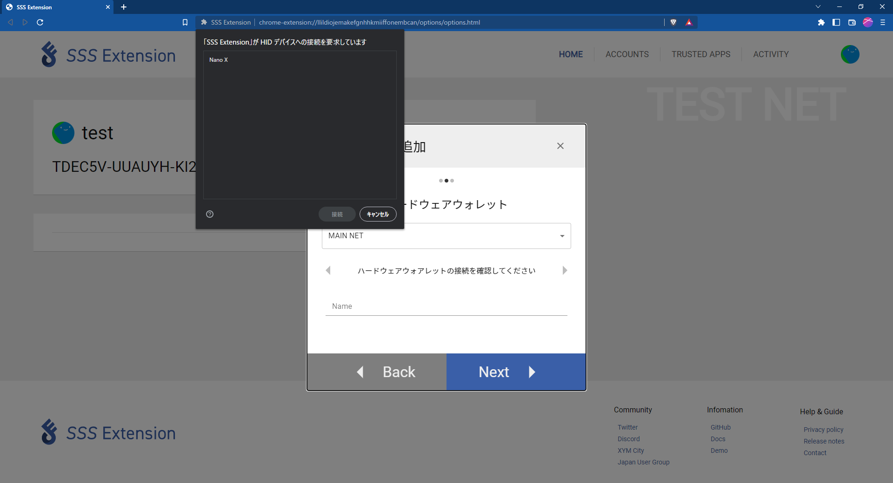
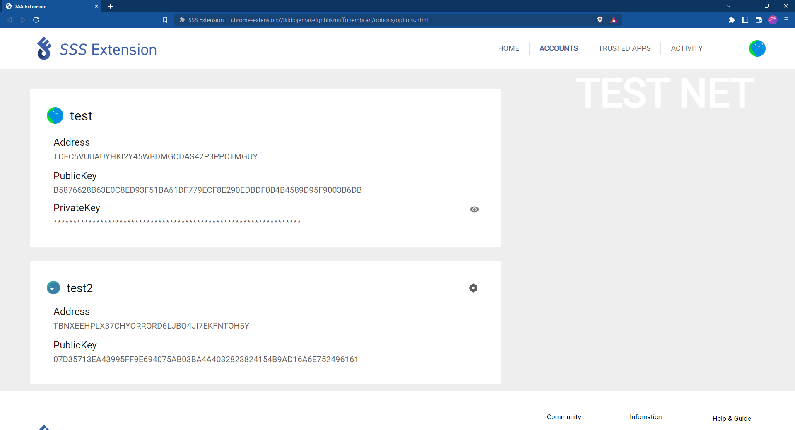

# Account Setting

SSS Extension のアカウント操作について説明します。

## アカウントのインポート

:::danger

- SSS Extension は秘密鍵、パスワードを保存しないためご自身で機密情報を紛失しないようにご注意ください。
- SSS Extension はユーザーによって設定されたパスワード等を用いて暗号化された暗号化秘密鍵を保存します。
- パスワードを忘れた場合、SSS Extension 上で署名を行えなくなります。アカウントの登録を解除して再登録が必要となります。

:::
SSS Extension ではアカウントを登録する方法として以下の 3 種類をサポートしています。

画面右上のアイコンをクリックし、アカウント追加を選択するとアカウントを追加する画面が表示されます。

- 秘密鍵をインポート
- 新規アカウント生成
- ハードウェアウォレット

### 1. 秘密鍵をインポート

「秘密鍵をインポート」を選択すると次のような画面が表示されます。

- Name : 追加するアカウントの名前を自由に入力してください。
- Address : 追加するアカウントの Symbol アドレスを入力してください。
- PrivateKey : 追加するアカウントの秘密鍵を入力してください。
- Password : アカウントの認証に使用するパスワードを自由に入力してください。

入力欄の項目を埋め、右下の「Next」ボタンをクリックしてください。

入力内容を確認する画面へと移動したら、入力した内容を確認し「Done」ボタンをクリックしアカウントの登録を完了します。

入力内容を訂正したい場合は、「Back」ボタンをクリックし、再度設定を行ってください。

### 2. アカウント作成

「アカウントを生成」を選択すると次のような画面が表示されます。

- Name : 追加するアカウントの名前を自由に入力してください。
- Password : アカウントの認証に使用するパスワードを自由に入力してください。

入力欄の項目を埋め、右下の「Next」ボタンをクリックしてください。

入力内容を確認する画面へと移動したら、入力した内容を確認し「Done」ボタンをクリックしアカウントの登録を完了します。

入力内容を訂正したい場合は、「Back」ボタンをクリックし、再度設定を行ってください。

### 3. ハードウェアウォレット

「ハードウェアウォレット」を選択すると次のような画面が表示されます。

SSS_Extension は Ledger 製のハードウェアウォレットに対応しています。対応製品を PC へと接続し、
Symbol アプリケーションを開くと、接続しているハードウェアウォレットが表示されるため、接続してください。

ネットワークと追加するアドレスを選択し、名前を設定し「Next」ボタンをクリックしてください。

入力内容を確認する画面へと移動したら、入力した内容を確認し「Done」ボタンをクリックしアカウントの登録を完了します。

入力内容を訂正したい場合は、「Back」ボタンをクリックし、再度設定を行ってください。

## 秘密鍵の確認

アクティブアカウントの秘密鍵の右にある「目のアイコン」をクリックするとパスワード入力画面が表示されます。

パスワードを入力し、「CHECK」ボタンをクリックし秘密鍵を確認することができます。

## アクティブアカウントの変更

アカウント情報の右上の歯車アイコンをクリックするとメニューが開きます。

「Active Account に変更する」を押下することで、メニューを開いているアカウントをアクティブアカウントに変更することができます。

## アカウントの登録解除

アクティブアカウントの変更と同様、アカウントメニューを開き、「Account の登録を解除する」を押下することで、メニューを開いているアカウントの情報が SSS Extension から削除されます。
