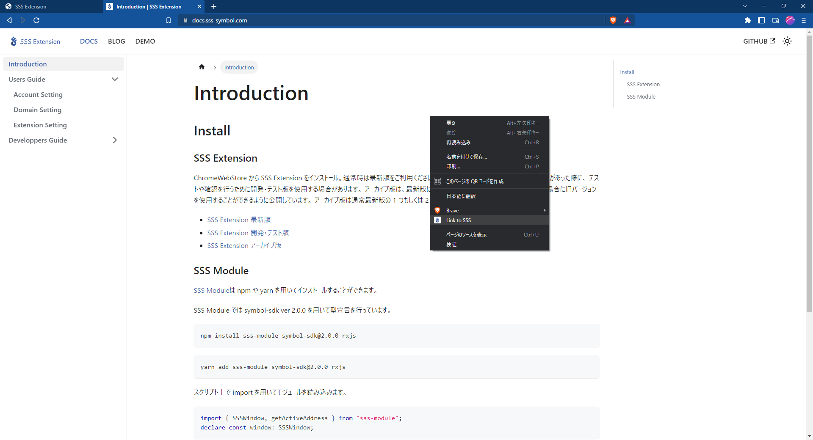
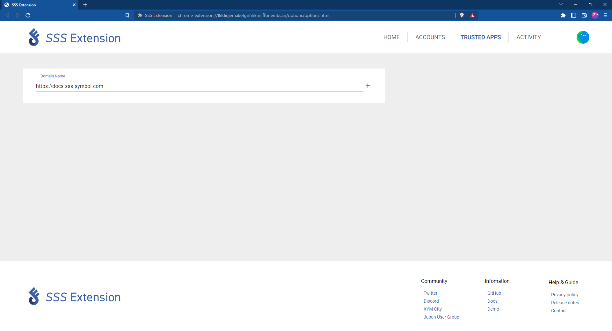
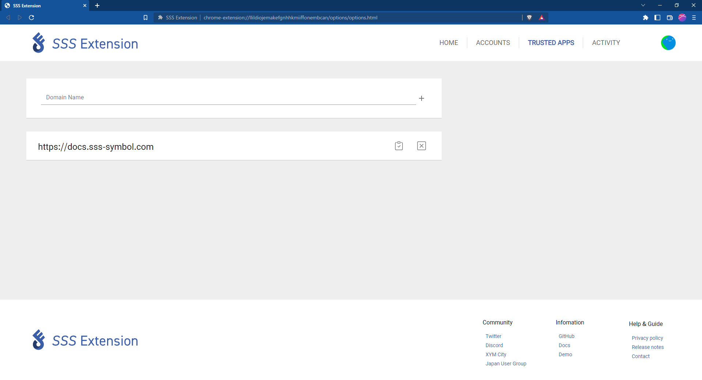

# Domain Setting

SSS Extension と dApps を連携する方法を説明します。

## dApps ページから連携する

SSS Extension と連携したい dApps ページ上で右クリックを行うと、メニューが開かれます。
そのメニューから「Link to SSS」を選択してください。ページを再度読み込むと SSS Extension と連携されます。

## 設定ページから連携する

SSS Extension の設定ページで「TRUSTED APS」タブを開き、テキストフィールドに連携したい dApps の URL を入力し「＋」ボタンを押下すると SSS Extension の連携リストに追加されます。

## 連携の解除

SSS Extension と dApps の連携を解除したい場合、URL の右に表示されている「☓」のアイコンを押下することで連携を解除することができます。

