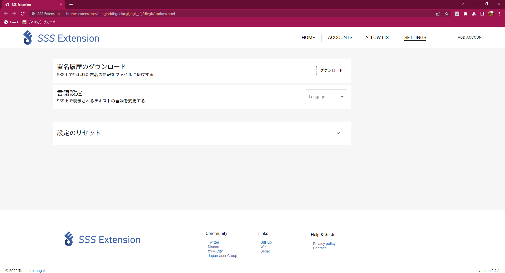
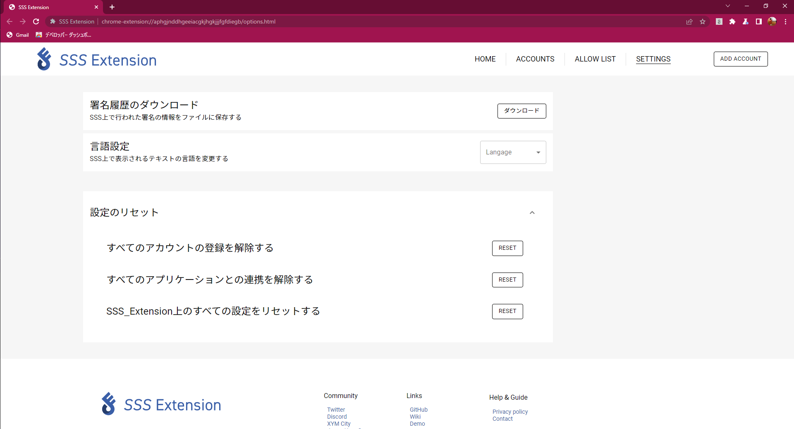

# Extension Setting

SSS Extension 全体の設定を行うページを説明します。

## 署名履歴のダウンロード

SSS Extension を用いて行った署名時のペイロードをファイルにダウンロードします。アナウンスに失敗した場合等、このペイロードから復元し、再アナウンスを行うことが可能です。

## 言語設定

SSS Extension 上のテキストの表示言語を変更します。現在 SSS Extension では以下の言語がサポートされています。
SSS Extension ではその他の言語への翻訳サポートを募集しています。

- 日本語
- English (英語)
- 한국어 (韓国語)
- Русский (ロシア語)
- Italian (イタリア語)

## 設定のリセット

アカウント情報や、ドメイン情報、SSS Extension の全設定を初期化することができます。

