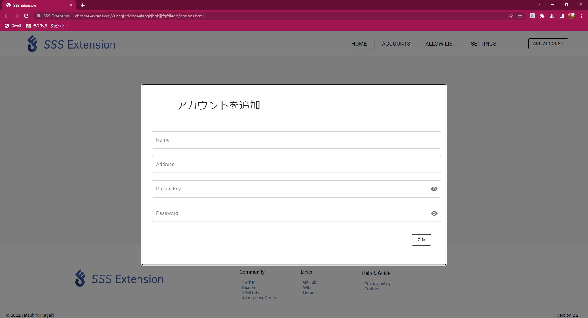
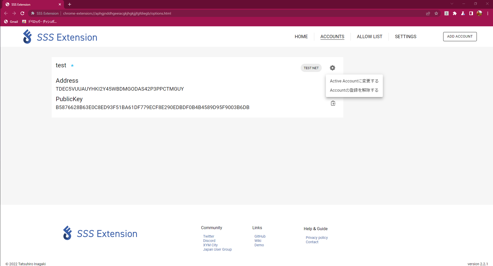

# Account Setting

SSS Extension のアカウント操作について説明します。

## アカウントのインポート

SSS Extension をインストールする、もしくは画面右上の「ADD ACCOUNT」ボタンを押下するとアカウントをインポートすることができます。
下図のような画面が表示されます。テキストフィールドに上から以下の項目を入力し、登録ボタンを押下し Symbol アカウントを SSS Extension へと登録することができます。

- 名前 : 追加する Symbol アカウントを識別する自由な名前
- アドレス : 追加したい Symbol アカウントのアドレス
- 秘密鍵 key : 追加したい Symbol アカウントの秘密鍵
- パスワード : 署名を行う際に使用する自由なパスワード

:::danger

- SSS Extension は秘密鍵、パスワードを保存しないためご自身で機密情報を紛失しないようにご注意ください。
- パスワードを忘れた場合、SSS Extension 上で署名を行えなくなります。アカウントの登録を解除して再登録が必要となります。

:::

## アクティブアカウントの変更

SSS Extension 設定ページで「ACCOUNTS」タブを開くと現在 SSS Extension に登録されているアカウントが一覧表示されます。
アカウントの名前の右に水色の星がついているアカウントが現在アクティブアカウントに設定されています。

アカウント情報の右上の歯車アイコンを押下すると下図のようなメニューが開きます。

アクティブアカウントで無いアカウントで「Active Account に変更する」を押下することで、メニューを開いているアカウントをアクティブアカウントに変更することができます。

## アカウントの登録解除

アクティブアカウントの変更と同様、アカウントメニューを開き、「Account の登録を解除する」を押下することで、メニューを開いているアカウントの情報が SSS Extension から削除されます。

しかし、アカウントが複数登録されている状態で、アクティブアカウントの登録を解除しようとした場合、「ActiveAccount を変更してください」とエラーが表示され、解除に失敗します。

アクティブアカウントを登録を解除したいアカウントから他のアカウントへと変更した後、再度アカウントの登録解除を行ってください。
