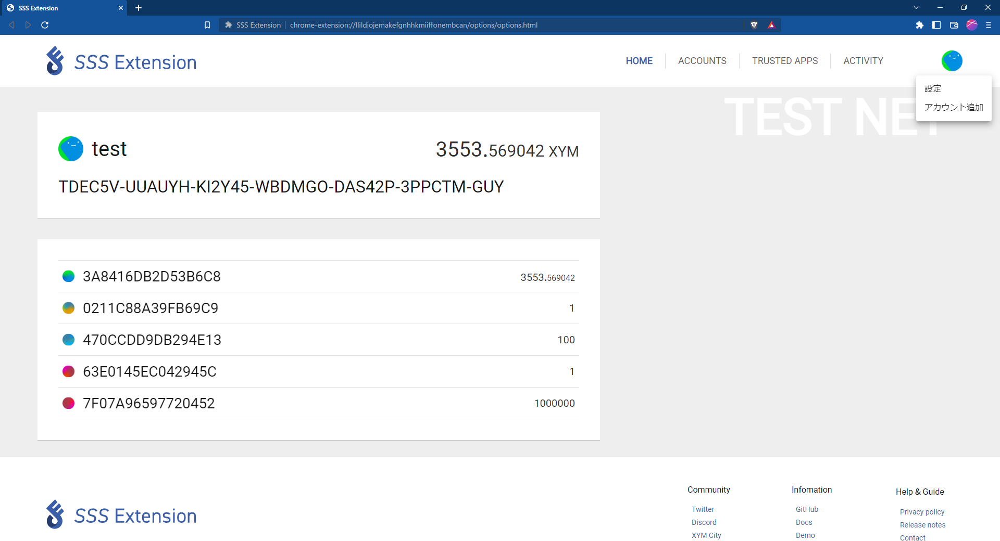

# Настройки аккаунта

В этом разделе описываются возможности аккаунта SSS Extension.

## Импорт аккаунта

:::danger

- SSS Extension не хранит приватные ключи и пароли, поэтому будьте осторожны, чтобы не потерять конфиденциальную информацию самостоятельно.
- SSS Extension хранит зашифрованный приватный ключ, зашифрованный пароль, установленным пользователем.
- Если вы забудете свой пароль, и вы не сможете войти в аккаунт SSS Extension, то вам нужно будет отменить регистрацию и заново зарегистрировать свой аккаунт, так вы сможете сбросить свой пароль.

:::
SSS Extension поддерживает следующие три метода регистрации аккаунта.

Щелкните значок в правом верхнем углу экрана и выберите «Добавить аккаунт», чтобы добавить свой аккаунт.

- Импорт приватного ключа
- Создать новый аккаунт
- Аппаратный кошелек

### 1. Импорт приватного ключа

「Когда вы выберете Импорт приватного ключа, появится следующий экран.

- Name : Введите любое имя для вашей учетной записи.
- Address : Введите адрес аккаунта Symbol, который вы хотите добавить.
- PrivateKey : Введите приватный ключ добавляемого аккаунта.
- Password : Введите пароль, который будет использоваться для аутентификации вашей учетной записи.

Пожалуйста, заполните поля ввода и нажмите кнопку «Далее» в правом нижнем углу.

Проверьте введенную информацию и нажмите кнопку «Готово», чтобы завершить регистрацию учетной записи.

Если вы хотите исправить введенную информацию, нажмите кнопку «Назад».

### 2. Регистрация

После выбора «Создать аккаунт» появится следующий экран.

- Name : Введите любое имя для вашей учетной записи.
- Password : Введите пароль, который будет использоваться для аутентификации вашей учетной записи.

Пожалуйста, заполните поля ввода и нажмите кнопку «Далее» в правом нижнем углу.

После перехода к экрану подтверждения, пожалуйста проверьте введенную информацию и нажмите кнопку «Готово», чтобы завершить регистрацию аккаунта.

Если вы хотите исправить введенную информацию, нажмите кнопку «Назад».

### 3. Аппаратный кошелек

Выберите «Аппаратный кошелек», и появится следующий экран.

SSS Extension поддерживает аппаратные кошельки Ledger. Таким образом, вы можете подключить Ledger к своему ПК, а затем открыть десктопный кошелек Symbol, и вы увидите подключенный аппаратный кошелек на экране, и вы можете легко связать его с SSS Extension.

Выберите сеть и адрес для добавления, задайте имя и нажмите кнопку «Далее».

Далее проверьте введенную информацию и нажмите кнопку «Готово», чтобы завершить регистрацию аккаунта.

Если вы хотите исправить введенную информацию, нажмите кнопку «Назад».

## Подтверждение приватного ключа

Щелкните значок глаза справа от приватного ключа активной аккаунта, чтобы отобразить экран ввода пароля.

Вы можете проверить приватный ключ, введя пароль и нажав кнопку «ПРОВЕРИТЬ».

## Изменить активный аккаунт 

Щелкните значок шестеренки в правом верхнем углу, чтобы открыть меню.

Нажав «Изменить на активную учетную запись», вы можете изменить учетную запись, на активную учетную запись.

## Отмена регистрации аккаунта

Откройте меню аккаунта и нажмите «Отменить регистрацию аккаунта», информация об аккаунте, будет удалена из расширения SSS.
