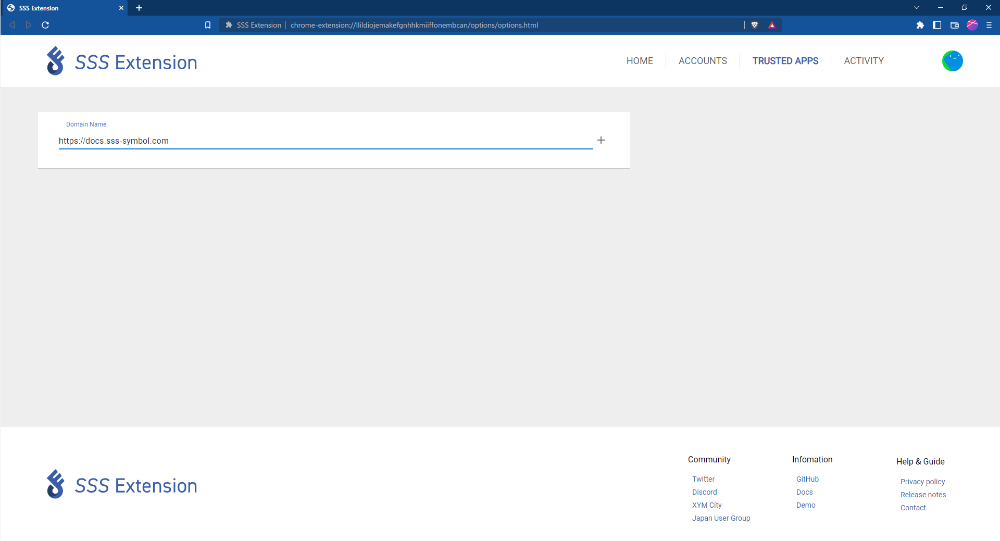
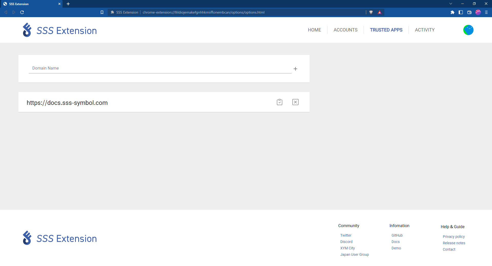

# Настройка домена

В этом разделе будет рассказано как связать SSS_Extension и децентрализованное приложение (dApps).

## Интеграция dApps

Щелкните правой кнопкой мыши на страницу dApps, чтобы открыть меню.
Выберите «Связать с SSS» в этом меню. Перезагрузите страницу и все заработает с SSS_Extension.

## Ссылка на страницу настроек

Откройте вкладку «TRUSTED APS», введите URL-адрес приложения dApp, которое вы хотите связать, в текстовое поле и нажмите кнопку «+», чтобы добавить его в список SSS_Extension.

## Отключение dApps

Если вы хотите отвязать децентрализованное приложение (dApps) от SSS_Extension, вы можете легко сделать это, щелкнув значок «☓», отображаемый справа от URL-адреса.

