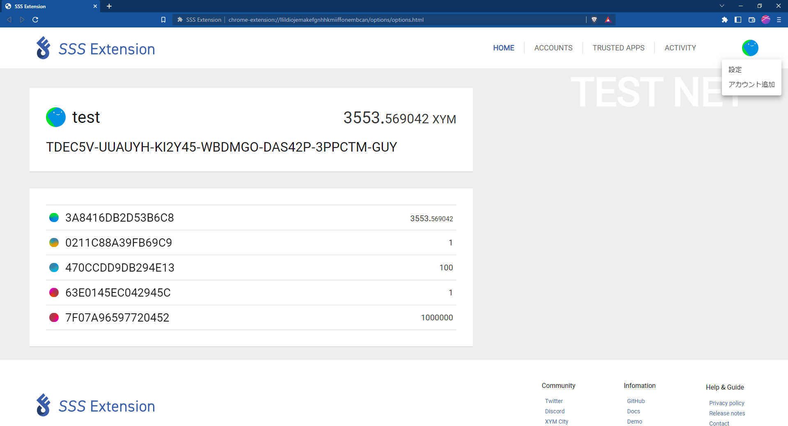
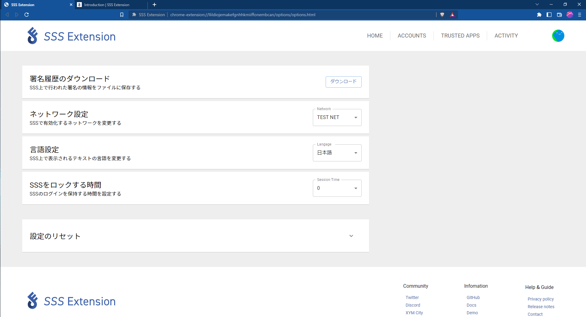

# Расширенные Настройки 

Нажмите значок в правом верхнем углу экрана и нажмите «Настройки», чтобы перейти на страницу настроек.

В этом разделе описывается основные настройки для SSS Extension.

## Скачать историю транзакций

Загрузите историю транзакций, с помощью расширения CSS, в файл.

## Сетевые настройки

Настройте сеть (Публичную или Тестнет), для использования с расширением SSS.

## Языковые настройки

Измените язык отображения текста в SSS Extension. Данный виджет в настоящее время поддерживает следующие языки:

- 日本語
- English
- 한국어
- Русский
- Italian

## Время блокировки SSS

Вы можете установить, как долго будет открыта ваша сессия в системе SSS Extension. Исходная настройка: 0 мин.

:::Внимание

Поскольку пароль хранится в течение определенного периода времени в системе, поэтому существует риск утечки вашего ключа.

:::

## Сброс настроек 

Вы можете сбросить все настройки аккаунта.
